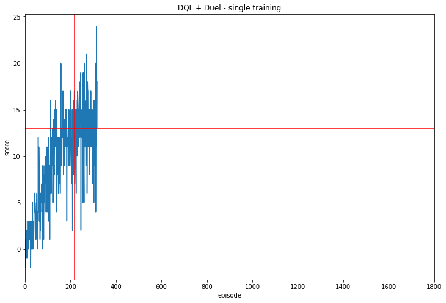

# REPORT
# Project 1: Navigation
## Udacity Deep Reinforcement Learning Nanodegree

## Introduction

In this report, an overview is given of various approaches that were used to solve Project 1: Navigation of the Udacity Deep Reinforcement Learning Nanodegree.

## Project details

_This section has been copied from the README file._

_(Udacity)_

The goal of the project is to teach a Deep Reinforcement Learning agent to intercept yellow bananas (reward +1) while avoiding blue bananas (reward -1) as it moves through an enclosed two-dimensional square environment. The visualized perspective is first-person. 

The environment is driven by the [Unity Machine Learning Agents Toolkit](https://github.com/Unity-Technologies/ml-agents). However, the environment is not identical to the Unity-included 'Banana Collector' environment.

The state-space is 37-dimensional, containing measurements such as the agent's velocity and ray-based perception of objects in the region ahead of the agent.

At each step, the agent can choose between four actions:

* 0: forward
* 1: backward
* 2: left
* 3: right

Learning is episodic. Each episode always contains exactly 300 steps.

The problem is considered to be solved as soon as the average reward over the preceding 100 episodes exceeds 13. It is known that the problem should be solvable within 1800 episodes. The fewer episodes required, the better.

## Approaches

The baseline approach is Deep Q-Network (DQN) learning. This approach is briefly described in the next subsection. Three modifications/extensions of DQN have also been implemented. These have been used singly as well as in combination. These are briefly described in the subsequent subsections.

### Deep Q-Learning (DQN)

In short, in [Deep Q-Learning](https://storage.googleapis.com/deepmind-media/dqn/DQNNaturePaper.pdf), a neural network is used to map a non-linear state-to-action function within a Q-learning context. To make this practicable, the concepts of replay memory with sampling as well as fixed targets are introduced. More specifically:

1. Initialize replay memory $D$ with capacity $N$.
* Initialize action-value approximating network $Q$ with random weights $\theta$.
* Let $\theta^{-} \leftarrow \theta$.

Then iterate over episodes, and within episodes iterate over time-steps. At each time-step, a Pronounce operation is performed; at each $n$th time-step (with $n$ predefined), a Learn operation is performed. This process is halted once the problem has been solved or after a maximum number of episodes.

#### Pronounce operation

1. With probability $\epsilon$, select a random action $a_t$ otherwise select $a_t = \textrm{argmax}_{a} Q(s_t, a, \theta)$, with $s_t$ the state at time $t$.
* Take action $a_t$, then observe reward $r_t$ and the next state $s_{t+1}$.
* Store the experience tuple $(s_t, a_t, r_t, s_{t+1})$ in $D$.

#### Learn operation

1. Randomly sample a minibatch of tuples $(s_j, a_j, r_j, s_{j+1})$ for $j = 1, \ldots, K$ from $D$.
* Define the _predicted_ values $\widehat{y}_j \leftarrow Q(s_{j}, a_j, \theta)$ for $j = 1, \ldots, K$.
* For $j = 1, \ldots, K$: if an episode terminates at step $j+1$, let the _target_ value $y_j \leftarrow r_j$; else let $y_j \leftarrow r_j + \gamma \max_{a} Q(s_{j+1}, a, \theta^{-})$ with $\gamma$ a discount factor.
* Calculate the temporal difference (TD) errors: $\delta_j \leftarrow y_j - \widehat{y}_j$ for $j = 1, \ldots, K$.
* To improve stability, clip $\delta_j$ to the interval $[-1, 1]$ for $j = 1, \ldots, K$.
* Calculate a loss function $L(\{y_j\}, \{\widehat{y}_j\})$. For example $\textrm{MSE}(\{y_j\}, \{\widehat{y}_j\}) = \tfrac{1}{K}\sum_{j = 1}^{K}(y_j - \widehat{y}_j)^2$.
* Perform a gradient descent step via backpropagation: $\theta \leftarrow \theta - \lambda \Delta_{\theta} L$ with $\lambda$ the learning rate. (A more specialised deep learning optimizer can also be used.)
* Perform a soft-update: $\theta^{-} \leftarrow \tau \theta + (1 - \tau) \theta^{-}$ for some $\tau \in (0, 1)$.

### Double DQN (DDQN)

In this [adaptation](https://arxiv.org/abs/1509.06461) of DQN, the target values are instead calculated as follows:

* For $j=1, \ldots, K$: if an episode terminates at step $j + 1$, let the target value $y_j \leftarrow r_j$; else let $y_j \leftarrow r_j + \gamma Q(s_{j+1}, \textrm{argmax}_{a} Q(s_{j+1}, a, \theta), \theta^{-})$.

This adjustment tends to lead to greater stability during training. (In the case where $\theta = \theta^{-}$, the two definitions coincide.)

### Prioritized Experience Replay (PER)

In [Prioritized Experience Replay](https://arxiv.org/abs/1511.05952), the replay memory is adjusted so that an experience is more likely to be sampled the higher its last TD-error is. In this way, the network can learn more often from examples on which it has previously performed poorly. More specifically, the following adjustments are made relative to vanilla DQN:

#### Pronounce operation

1. _[Unchanged.]_  With probability $\epsilon$, select a random action $a_t$ otherwise select $a_t = \textrm{argmax}_{a} Q(s_t, a, \theta)$, with $s_t$ the state at time $t$.
* _[Unchanged.]_ Take action $a_t$, then observe reward $r_t$ and the next state $s_{t+1}$.
* Store the experience tuple $(s_t, a_t, r_t, s_{t+1})$ in $D$ with maximal priority $p_t = \max_{i < t}p_i$.

#### Learn operation

1. With probability $P(j) = p_{j}^{\alpha} / \sum_{i}p_i^{\alpha}$, select tuple $(s_j, a_j, r_j, s_{j+1})$ from $D$ for $j = 1, \ldots, K$, with $\alpha \in [0, 1]$.
* _[Unchanged.]_ Define the predicted values $\widehat{y}_j \leftarrow Q(s_{s_j}, a_j, \theta)$ for $j = 1, \ldots, K$.
* _[Unchanged.]_ For $j = 1, \ldots, K$: if an episode terminates at step $j+1$, let the target value $y_j \leftarrow r_j$; else let $y_j \leftarrow r_j + \gamma \max_{a} Q(s_{j+1}, a, \theta^{-})$ with $\gamma$ a discount factor.
* _[Unchanged.]_ Calculate the temporal difference (TD) errors: $\delta_j \leftarrow y_j - \widehat{y}_j$ for $j = 1, \ldots, K$.
* _[Unchanged.]_ To improve stability, clip $\delta_j$ to the interval $[-1, 1]$ for $j = 1, \ldots, K$.
* Determine gradient weights $w_j \leftarrow (N \cdot P(j))^{-\beta}$ for $j = 1, \ldots, K$.
* Standardise the gradient weights: $w_j \leftarrow w_j / \sum_{i} w_i$ for $j = 1, \ldots, K$.
* Calculate a decomposable, weighted loss function $L_{\textbf{w}}(\{y_j\}, \{\widehat{y}_j\}) = c \sum_{j=1}^{K}  w_j \ell(y_j, \widehat{y}_j)$ for some $c$. For example $\textrm{MSE}_{\textbf{w}}(\{y_j\}, \{\widehat{y}_j\}) = \tfrac{1}{K}\sum_{j = 1}^{K} w_j (y_j - \widehat{y}_j)^2$.
* Perform a gradient descent step via backpropagation: $\theta \leftarrow \theta - \lambda \Delta_{\theta} L_{\textbf{w}}$ with $\lambda$ the learning rate. (A more specialised deep learning optimizer can also be used.)
* _[Unchanged.]_  Perform a soft-update: $\theta^{-} \leftarrow \tau \theta + (1 - \tau) \theta^{-}$ for some $\tau \in (0, 1)$.
* Update the replay priority $p_j \leftarrow \vert \delta_j \vert$ in $D$ for $j = 1, \ldots, K$.

There are two new hyperparameters, $\alpha$ and $\beta$. It's best to increment $\beta$ during training so that it approaches 1 as training ends.

Note: Because $L_\textbf{w}$ is linear in $\{w_j\}$, the formulation above is equivalent to that in the original article, where the gradient weights are used to combine experience-wise gradients. Both approaches are implemented in the `src` directory, however the formulation above is computationally much more efficient in PyTorch.

### Dueling Network (Duel)

The [Deuling Network](https://arxiv.org/abs/1511.06581) approach makes no algorithmic changes. However, it imposes a specific form on the architecture of $Q$. 

Ordinarily $Q$ _directly_ and _jointly_ quantifies the effect of state $s$ and action $a$ using the learned representation $\theta$. This can be written as $Q(s, a, \theta)$. However, in a Dueling Network architecture, $Q(s, a, \theta)$ is calculated _indirectly_ and at first _separably_ from two decomposed parts: $$Q(s, a, \theta, \alpha, \beta) = V(s, \theta, \beta) + A(s, a, \theta, \alpha).$$ Here $V$ captures the effect of the state $s$ independently of any action, while $A$ captures the offset that results from taking a specific action in that state. Conceptually, this is a more parsiminous parameterisation than $Q(s, a, \theta)$.

To achieve this, the last few layers of $Q$ can be split into two separate streams. Then $\theta$ represents earlier shared parameters, while the parameters $\beta$ are unique to $V$ and the parameters $\alpha$ are unique to $A$.

The decomposition above isn't uniquely identifiable, however. To make it so, the constraint $$A(s, a, \theta, \alpha) \leftarrow A(s, a, \theta, \alpha) - \max_{a' \in \vert A \vert} A(s, a', \theta, \alpha)$$ can be introduced. This sets the _maximum_ action offset to zero. In practise, though, the following constraint is used instead to good effect: $$A(s, a, \theta, \alpha) \leftarrow A(s, a, \theta, \alpha) - \tfrac{1}{\vert A \vert}\sum_{a'} A(s, a', \theta, \alpha).$$ In this case, the _average_ action offset is set to zero.

## Agents 

Six agents were used to tackle this problem. They employ the following combination of approaches (for more details, see `src/train.ipynb`):

* Agent 1: DQN
* Agent 2: DQN + DDQN
* Agent 3: DQN + PER
* Agent 4: DQN + Duel
* Agent 5: DQN + DDQN + PER
* Agent 6: DQN + DDQN + PER + Duel

### Hyperparameter values

All agents share the same hyperparameters. Although the hyperparameters were hand-tuned to informally optimize the performance of Agent 6, performance is good on all agents. Not all of the hyperparameters listed below are applicable to all agents.

| Hyperparameter | | Value |
|--- |---	|--- |
| state_size | | 37 |
| action_size	| | 4 |
| max_episodes | | 5000 |
| max_t | | 300 | 
| buffer_size | $N$ | 1e5 |
| batch_size | $K$ | 64 |
| epsilon_start | |  0.9 |
| epsilon_end | | 0.05 |
| epsilon_day | | 0.99 |
| update_every | $n$ | 4 |
| gamma | | 0.99 |
| tau | | 0.025 |
| alpha | | 0.6 |
| beta_start | | 0.4 |
| beta_end | | 1.0 |
| beta\_max\_episodes | | 350 |
| learning_rate | $\lambda$ | 5e-4 |

### Model architectures

In the **non-Dueling Network** case, $Q$ is given the following architecture:

* Fully-connected: 37-dimensional to 64-dimensional
* RELU activation function
* Fully-connected: 64-dimensional to 32-dimensional
* RELU activation function
* Fully-connected: 32-dimensional to 16-dimensional
* RELU activation function
* Fully-connected: 16-dimensional to 4-dimensional

In the **Dueling Network** case, $Q$ is given the following architecture:

* Fully-connected: 37-dimensional to 64-dimensional
* RELU activation function
* Fully-connected: 64-dimensional to 32-dimensional
* RELU activation function

Then separately for $V$: 

* Fully-connected: 32-dimensional to 16-dimensional
* RELU activation function
* Fully-connected: 16-dimensional to 1-dimensional

and likewise separately for $A$:

* Fully-connected: 32-dimensional to 16-dimensional
* RELU activation function
* Fully-connected: 16-dimensional to 4-dimensional

Then finally jointly again by adding $V$ to mean-centred $A$.

## Results

The following graphs show the learning progress during a single training of each of Agents 1 to 6.

In all cases the required number of episodes to solve the problem was fewer than 263 (in the sense that the average score in the succeeding 100 epoides was at least 13). This is substantially fewer than the baseline of 1800. 

To more fairly compare the different agents, each was trained from scratch 15 times (a larger number of repetitions would have taken too long). The following table gives the minimum, median and maximum number of epsides required for each agent.

| | Agent | Min | Median | Max |
|----|---|---	|---|--- |
|1| DQN | 125 |  142 | 170 |
|2| DQN + DDQN |  125 | 152 | 195|
|3| DQN + PER |  134 | 157 | 197|
|4| DQN + Duel |  122 | 140 | 183|
|5| DQN + DDQN + PER | 127 | 152 |192 |
|6| DQN + DDQN + PER + Duel | 125 | 142 | 211 |

The distributions themselves can be represented as follows:

For more details on all these results, see `src/train.ipynb`.

It appears that for this problem and parameterisation at least, the more sophisticated techniques do not substantially reduce the number of episodes required.

Especially with Dueling Networks this may perhaps be expected since it performs well especially when there is a large number of actions.

## Ideas for future work

A number of additional state-of-the-art ideas that can be tried are listed [here](https://www.endtoend.ai/envs/gym/atari/).

## Conclusion

A main approach (DQN) and three different modifications/extensions (DDQN, PER, Duel) were implemented. In various combinations, these were used to train agents that could very effectively solve the problem at hand: navigating so as to intercept yellow bananas while avoiding blue bananas.
